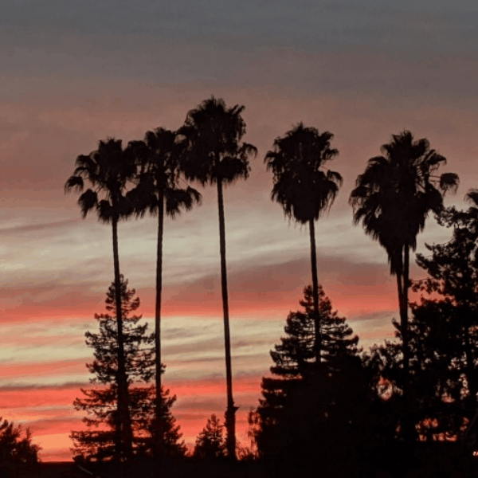

# mwen0562_9103_tut4
## Imaging Technique Inspiration

I chose the rock poster style of the last century as my design inspiration. This style is known for its unique visual elements, this style transforms real photographs into artwork with specific color prints. I thought this style could add a retro charm to my assignments, as well as a nod to a bygone era. I plan to emulate this style by using similar color palettes, styles, and typographic elements and apply it to my assignments.

## Coding Technique Exploration

A similar coding technique for converting images into the style of last century rock posters is called Image Palette. Color quantization reduces the number of different colors in the image while maintaining its visual quality, allowing for the poster's characteristic color palette.

[Example Code Link](https://happycoding.io/tutorials/p5js/images/image-palette)

