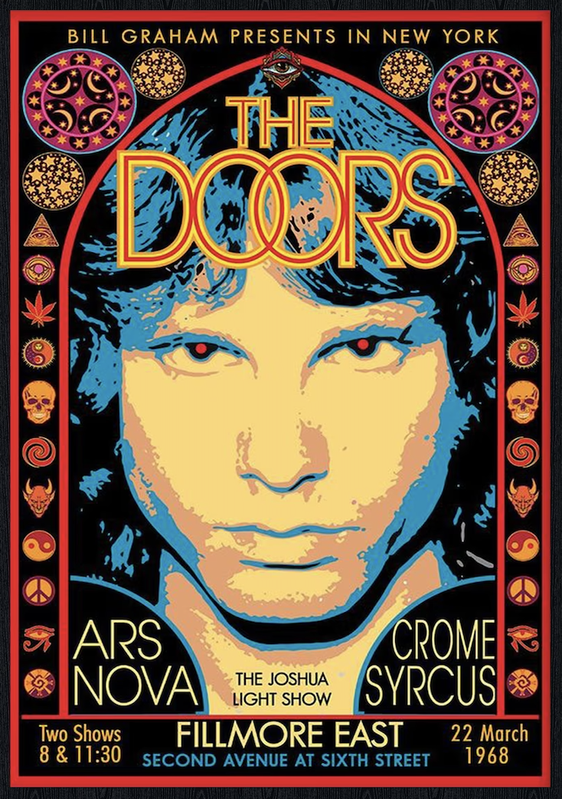
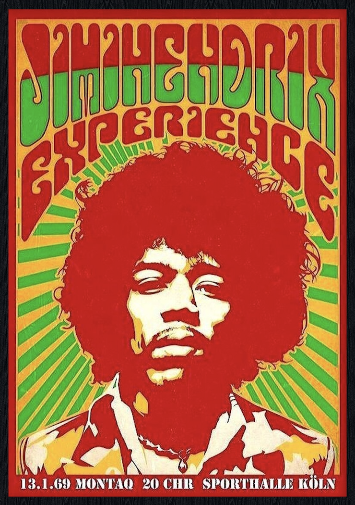
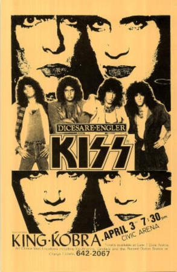

# mwen0562_9103_tut4
## Imaging Technique Inspiration

I chose the rock poster style of the last century as my design inspiration. This style is known for its unique visual elements, including bright colors, grotesque illustrations, and exaggerated typography. I thought this style could add a retro charm to my assignments, as well as a nod to a bygone era. I plan to emulate this style by using similar color palettes, illustration styles, and typographic elements and apply it to my designs.

## Coding Technique Exploration

为了实现类似《2001太空漫游》中的太空飞船光影效果，我计划使用OpenGL图形库。这个库提供了强大的渲染功能，可以用来创建复杂的光影效果，以增强我的设计。

[示例代码链接](链接到示例代码的URL)

